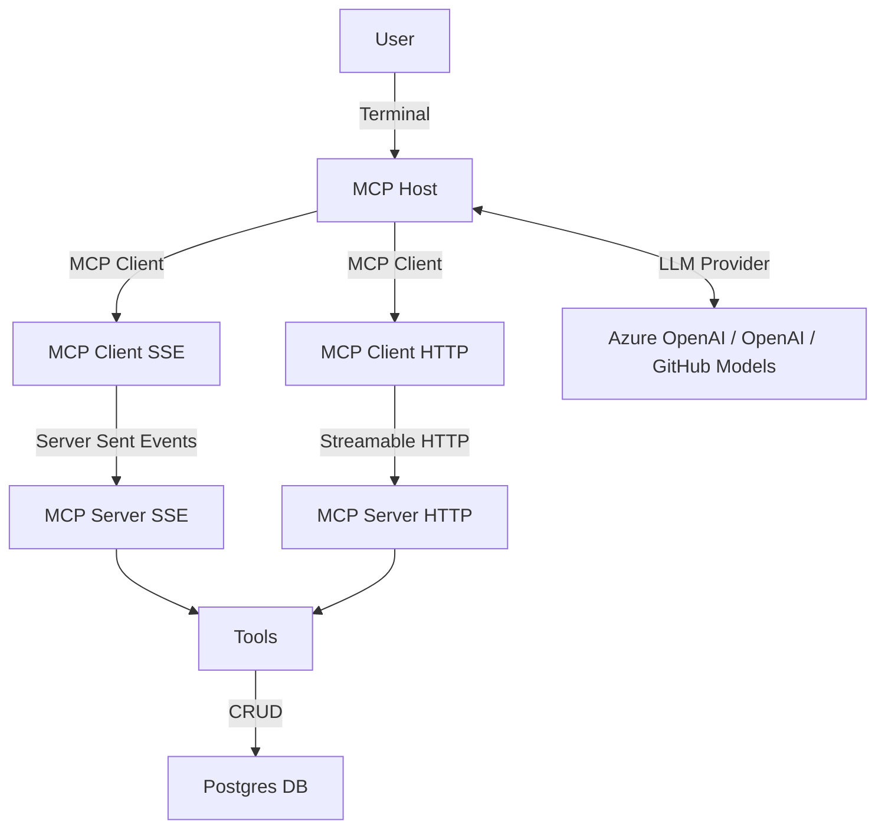

# Azure Container Apps - AI & MCP Playground

This project showcases how to use the MCP protocol with OpenAI, Azure OpenAI and GitHub Models. It provides a simple demo terminal application that interacts with a TODO list Agent. 
The agent has access to a set of tools provided by the MCP server.

## MCP Components

The current implementation consists of three main components:
1. **MCP Host**: The main application that interacts with the MCP server and the LLM provider. The host instanciates an LLM provider and provides a terminal interface for the user to interact with the agent.
2. **MCP Client**: The client that communicates with the MCP server using the MCP protocol. The application providers two MCP clients for both HTTP and SSE (Server-Sent Events) protocols.
3. **MCP Server**: The server that implements the MCP protocol and communicates with the Postgres database. The application provides two MCP server implementations: one using HTTP and the other using SSE (Server-Sent Events).
4. **LLM Provider**: The language model provider (e.g., OpenAI, Azure OpenAI, GitHub Models) that generates responses based on the input from the MCP host.
5. **Postgres**: A database used to store the state of the agent and the tools.
6. **Tools**: A set of tools that the agent can use to perform actions, such as adding or listing items in a shopping list.



## MCP Server supported features and capabilities

This demo application provides two MCP server implementations: one using HTTP and the other using SSE (Server-Sent Events). The MCP host can connect to both servers, allowing you to choose the one that best fits your needs.


| Feature             | Completed |
| ------------------- | --------- |
| SSE (legacy)        | ✅        |
| HTTP Streaming      | ✅        |
| AuthN (token based) | wip        |
| Tools               | ✅        |
| Resources           | #3        |
| Prompts             | #4        |
| Sampling            | #5        |

## Getting Started

To get started with this project, follow the steps below:

### Prerequisites

- Node.js and npm (version 22 or higher)
- Docker (recommended for running the MCP servers, and Postgres in Docker)
- An OpenAI compatible endpoint:
  - An OpenAI API key
  - Or, a GitHub token, if you want to use the GitHub models: https://gh.io/models
  - Or, if you are using Azure OpenAI, you need to have an [Azure OpenAI resource](https://learn.microsoft.com/azure/ai-services/openai/chatgpt-quickstart?tabs=keyless%2Ctypescript-keyless%2Cpython-new%2Ccommand-line&pivots=programming-language-javascript) and the corresponding endpoint.

### Installation

1. Clone the repository.
2. Install the dependencies:

```bash
npm install --prefix mcp-host
npm install --prefix mcp-server-http
npm install --prefix mcp-server-sse
```

### Configuring LLM providers to use

This sample supports the follwowing LLM providers:

- Azure OpenAI,
- OpenAI,
- GitHub Models.

#### Azure OpenAI

> [!NOTE]
> Accessing Azure OpenAI using Managed Identity is not supported when running in a Docker container (locally). You can either run the code locally without Docker or use a different authentication method, such as AZURE_OPENAI_API_KEY key authentication.

In order to use Keyless authentication, using Azure Managed Identity, you need to provide the `AZURE_OPENAI_ENDPOINT` environment variable in the `.env` file:

```env
AZURE_OPENAI_ENDPOINT="https://<ai-foundry-openai-project>.openai.azure.com"
MODEL="gpt-4.1"

# Also, please use API Key when running the MCP host in a Docker container (locally).
# AZURE_OPENAI_API_KEY=your_azure_openai_api_key
```

And make sure to using the [Azure CLI](https://learn.microsoft.com/cli/azure/) to log in to your Azure account and follow the instructions to selection your subscription:

```bash
az login
```

#### OpenAI

To use the OpenAI API, you need to set your `OPENAI_API_KEY` key in the `.env` file:

```env
OPENAI_API_KEY=your_openai_api_key
MODEL="gpt-4.1"
```

#### GitHub Models

To use the GitHub models, you need to set your `GITHUB_TOKEN` in the `.env` file:

```env
GITHUB_TOKEN=your_github_token
MODEL="openai/gpt-4.1"
```
### Running the MCP servers
## Running in Docker

You can run both MCP servers in Docker containers using the provided Docker Compose file. This is useful for testing and development purposes. To do this, follow these steps:

1. Make sure you have Docker installed on your machine. Type `docker compose` in your terminal to check if Docker Compose is installed.
2. Navigate to the root directory of the project and run the following command to build and start the containers:

```bash
docker compose up -d --build
```

This command will build and start the HTTP and SSE MCP servers, as well as the Postgres database container.

3. Access the MCP host terminal by running the following command in a separate terminal:

```bash
docker exec -it mcp-host bash
```

4. Inside the container, you can run the MCP host and interact with the LLM agent as described in the Usage section above.

### Running outside of Docker

1. First, run the MCP servers, in separate terminals:

```bash
npm start --prefix mcp-server-http
npm start --prefix mcp-server-sse
```

> [!NOTE]
> For demo purposes, the MCP host (see below) is configured to connect to both servers (on port 3000 and 3001). However, this is not a requirement, and you can choose which server to use.

1. Run the MCP host in a separate terminal:

```bash
npm start --prefix mcp-host
```

You should be able to use the MCP host to interat with the LLM agent. Try asking question about adding or listing items in a shopping list. The host will then try to fetch and call tools from the MCP servers.


## Debugging and inspection

You can use the `DEBUG` environment variable to enable verbose logging for the MCP host:

```bash
DEBUG=mcp:* npm start --prefix mcp-host
```

Debugging is enabled by default for both MCP servers.

## License

This project is licensed under the MIT License. See the [LICENSE](LICENSE) file for details.
